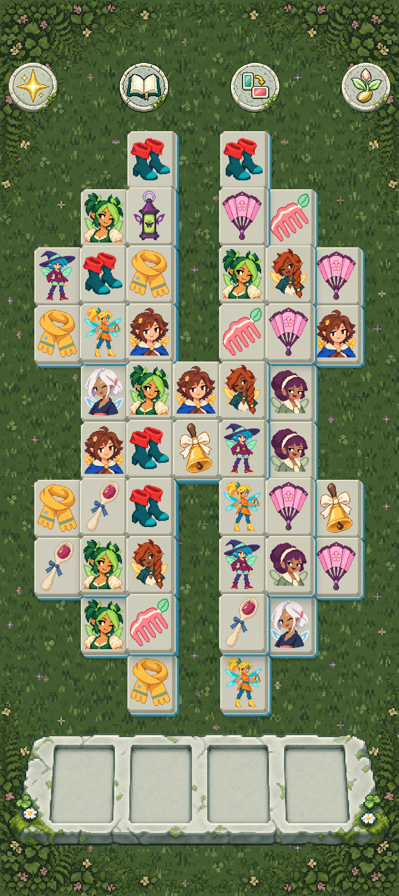

# FairyMahjong

Offline fairy tile matching for Android 8.0 and newer, by [FairyTrick](https://fairytrick.com).

[Download](https://github.com/FairyTrick/FairyMahjong/releases)
· [Builds](https://github.com/FairyTrick/FairyMahjong/actions)



## Build

Use JDK 17, Android SDK 37 and Build Tools 36.0.0. Set `JAVA_HOME` and `ANDROID_HOME`, then run:

```sh
./gradlew :app:assembleDebug
```

Use `gradlew.bat` on Windows. `:app:assembleRelease` builds an unsigned release APK.
Version tags (`vX.Y.Z`) publish signed APKs through GitHub Actions.

## License

Code and artwork are licensed under [Apache-2.0](LICENSE).
All game artwork was generated using OpenAI.
